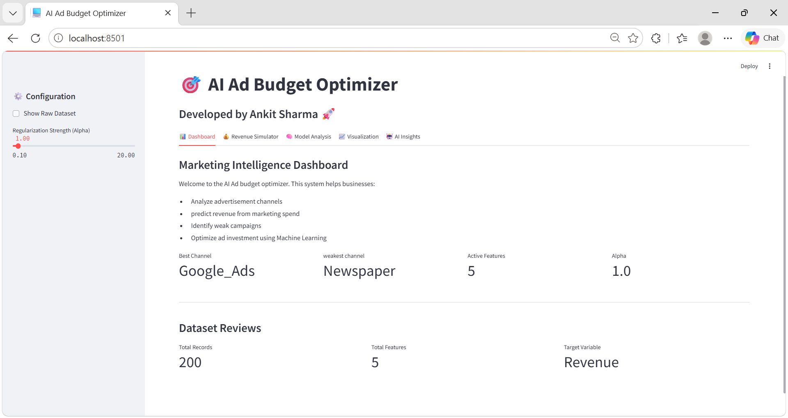
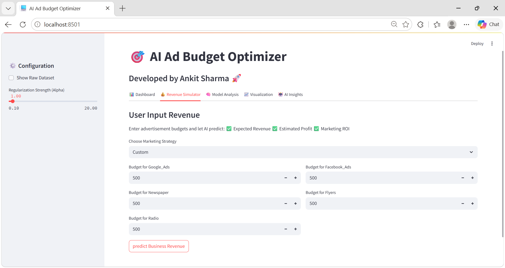
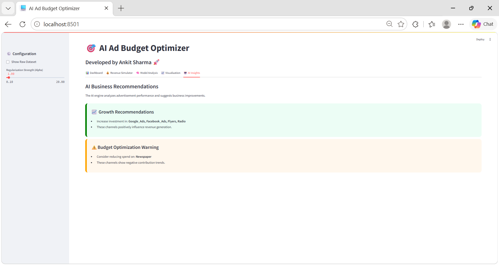

# AI-Ad-Budget-Optimizer
AI-powered Ad Budget Optimizer built with Python, Streamlit, and Machine Learning. Uses predictive analytics, revenue forecasting, budget optimization, interactive visualizations, and AI-driven business recommendations to analyze advertisement channel performance and improve marketing decisions.
# Project Interface
### Dashboard

### Revenue Simulator

### AI Insights
